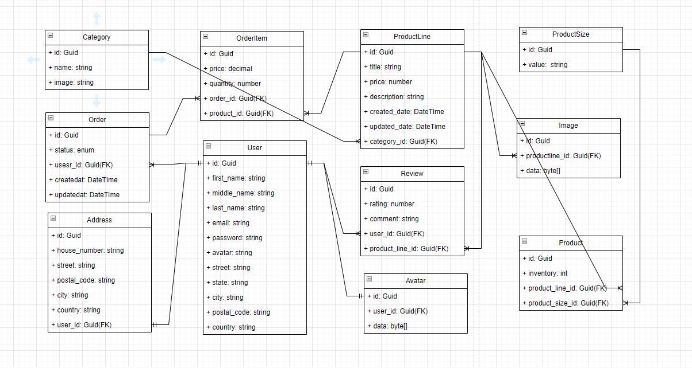

# Fullstack Project
## Introduction
This is an Ecommerce application design and deployed as a final assignment in Integrify academy. It is built using react in frontend, DotNet core in backend and postgres as database. The primary objective of this project is to develop a robust software application using best practices. 

## Table of Contents

1. [Technologies](#technologies)
2. [File Structure](#filestructure)
2. [Achitecture](#architecture)
2. [Features](#features)
2. [Functionalities](#functionalities)
3. [Requirements](#requirements)
4. [Getting Started](#getting-started)
5. [Testing](#testing)

## Technologies

   ### Frontend

      * Typescript
      * React
      * Redux (Toolkit)
      * React Router
      * Material UI

   ### Backend

      * DotNet Core
      * Entity Framework
      * Postgres

## File Structure
- ECOMMERCE
  - Ecommerce.Business
  - Ecommerce.Controller
  - Ecommerce.Core
  - Ecommerce.HttpTest
  - Ecommerce.Test
  - Ecommerce.WebAPI
  - Ecommerce.sln
  - README.md

## Architecture

   This project is developed following clean architecture. The architecture ensures system is more scalable for future enhancement and maintainability. It consist of
   1. WebAPI Layer
   2. Controller Layer
   3. Business Layer
   4. Core Layer

## ERD Diagram
   

## Features

   1. Create, View, edit and delete Products.
   2. Create, View, edit and delete Product Lines.
   2. Manage user and roles.
   3. Authenticate and Authorize user
   3. Manage Orders and OrderItems.
   4. Manage Reviews.

## Functionalities

Generate a solution file inside this repository. All the project layers of backend server should be added into this solution.

This project involves creating a Fullstack project with React and Redux in the frontend and ASP.NET Core 7 in the backend. The goal is to provide a seamless experience for users, along with robust management system for administrators.

- Frontend: SASS, TypeScript, React, Redux Toolkit
- Backend: ASP.NET Core, Entity Framework Core, PostgreSQL

You can follow the same topics as your backend project or choose the alternative one, between E-commerce and Library. You can reuse the previous frontend project, with necessary modification to fit your backend server.

## Table of Contents

1. [Instruction](#instruction)
2. [Features](#features)
   - [Mandatory features](#mandatory-features)
   - [Extra features](#extra-features)
3. [Requirements](#requirements)
4. [Getting Started](#getting-started)
5. [Testing](#testing)

## Instruction

This repository should be used only for backend server. The frontend server should be done in a separate repository [here](https://github.com/Integrify-Finland/fs16_6-frontend-project). You can modify your previous frontend project and instructors will check the submissions (pull requests) in the frontend project repository. The modified frontend server need to be connected with this backend server to make a whole fullstack project.

### Frontend

If you only modify the previoud frontend project, you can work on the same repository and there is no need to open new pull request. However, you can get back to your previous pull request and remove all the labels. In case you want to make new project from scratch, you can fork and clone the original repository and open new pullrequest for your new frontend.

### Backend

Generate a solution file inside this repository. All the project layers of backend server should be added into this solution.

## Features

### Mandatory features

#### User Functionalities

1. User Management: Users should be able to register for an user account and log in. Users cannot register themselves as admin.
2. Browse Products: Users should be able to view all available products and single product, search and sort products.
3. Add to Cart: Users should be able to add products to a shopping cart, and manage cart.
4. Checkout: Users should be able to place orders.

#### Admin Functionalities

1. User Management: Admins should be able to view and delete users.
2. Product Management: Admins should be able to view, edit, delete and add new products.
3. Order Management: Admins should be able to view all orders.

### Extra features

#### User Functionalities

1. User Management: Users should be able to view and edit only certain properties in their accounts. They also can unregister their own accounts.
2. Authentication and account registration with Google Oauth.
3. Order Management: Users should be able to view their order history, track the status of their orders, and potentially cancel orders within a certain timeframe.

#### Admin Functionalities

1. User Management: Admins should be able to edit users' role and create new users and admins.
2. Order Management: Admins should be able to update order status, view order details, and cancel orders.

And any other extra features that you want to implement (like file upload, reviews, payment, email, etc.).

## Requirements

1. Apply CLEAN architecture in your backend. In README file, explain the architecture of your project as well.
2. Error handler: This will ensure any exceptions thrown in your application are handled appropriately and helpful error messages are returned.
3. In backend server, unit testing (xunit) should be done, at least for Service(Use case) layer. We recommend to test entities, repositories and controllers as well.
4. Document with Swagger: Make sure to annotate your API endpoints and generate a Swagger UI for easier testing and documentation.
5. Project should have proper file structure, naming convention, and comply with Rest API.
6. `README` file should sufficiently describe the project, as well as the deployment, link to frontend github as well.
7. Frontend, backend, and database servers need to be available in the live servers.  

## Getting Started

1. Start with backend first before moving to frontend.
2. In the backend, here is the recommended order:

   - Plan Your Database Schema before start coding

   - Set Up the Project Structure

   - Build the models

   - Create the Repositories

   - Build the Services

   - Set Up Authentication & Authorization

   - Build the Controllers

   - Implement Error Handling Middleware

3. You should focus on the mandatory features first. Make sure you have minimal working project before opting for advanced functionalities.

Testing should be done along the development circle, early and regularly.

## Testing

Unit testing, and optionally integration testing, must be included for both frontend and backend code. Aim for high test coverage and ensure all major functionalities are covered.
